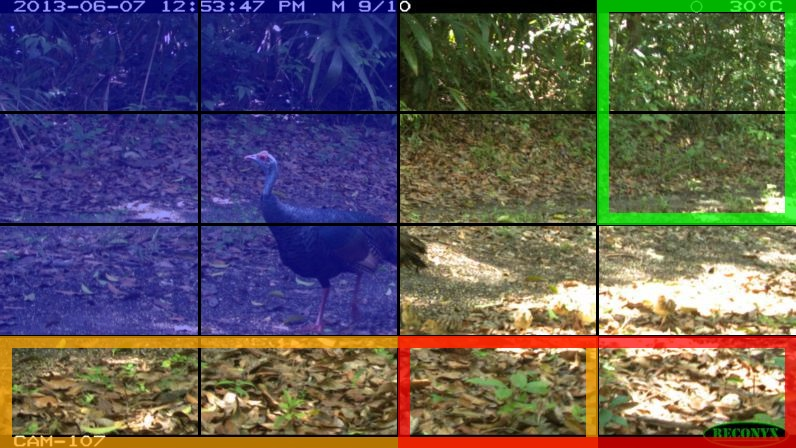

# WILDS-IJEPA

Fork of the official I-JEPA repo, adapted for WILDS-iWildCam.

Reference: official I-JEPA README https://github.com/facebookresearch/ijepa/blob/main/README.md

- SSL pretraining on WILDS-iWildCam unlabeled dataset: https://arxiv.org/abs/2112.05090 (Extending the WILDS Benchmark for Unsupervised Adaptation)
- Supervised training on WILDS-iWildCam labeled dataset: https://arxiv.org/abs/2012.07421 (WILDS: A Benchmark of in-the-Wild Distribution Shifts)
- Supervised learning supports full fine-tuning or freezing the encoder

<p align="center">
  
</p>

<p align="center">
  <em>I-JEPA masking on a real iWildCam camera-trap image: the context block (blue) is
  encoded to predict the representations of several target blocks (green/red/orange).</em>
</p>

## Models

- ViT-H, 14x14 patches, 224x224 resolution (trained)
- ViT-H, 16x16 patches, 448x448 resolution (trained)
- Plan: add a graph comparing models with the WILDS leaderboard https://wilds.stanford.edu/leaderboard/#with-unlabeled-data-1

## Results

Linear-probing evaluation on iWildCam2020-WILDS with a **frozen** I-JEPA encoder and a
single trained linear head. All values are the mean over 5 seeds (±std). The headline
metric is F1-Macro on the Target Out-of-Distribution (OOD) split; the gap
Δ = F1(ID) − F1(OOD) measures the drop under distribution shift. Only the
ImageNet-pretrained checkpoints are reported here.

| Model | ID F1-Macro | OOD F1-Macro | Gap ΔF1 |
|---|---|---|---|
| ViT-H/14 (224, IN-1K) | 0.338 ±0.015 | 0.214 ±0.006 | 0.124 |
| ViT-H/16 (448, IN-1K) | 0.385 ±0.005 | 0.247 ±0.003 | 0.138 |
| **ViT-H/14 (224, IN-22K)** | 0.348 ±0.003 | **0.260 ±0.003** | 0.088 |
| ViT-g/16 (224, IN-22K) | 0.371 ±0.002 | 0.255 ±0.003 | 0.116 |

Key takeaways:

- The best frozen probe (**ViT-H/14, IN-22K**) reaches **0.260 OOD F1-Macro**, ranking
  **#16** on the iWildCam2020-WILDS leaderboard — despite training only a linear head
  rather than fine-tuning the full backbone.
- Its ID→OOD generalization gap (ΔF1 = 0.088) is comparable to the full-fine-tuning
  CLIP leaders on the leaderboard (FLYP ΔF1 = 0.139, AutoFT ΔF1 = 0.115).
- Absolute F1-Macro scales with pretraining data (IN-22K > IN-1K) and input resolution
  (the higher-resolution ViT-H/16 448 is the strongest IN-1K checkpoint).

### Label efficiency

Because I-JEPA pretrains without labels, the representations stay useful when labeled
data is scarce. OOD Target F1-Macro when the linear probe trains on 1%, 10%, 50%, and
100% of the labeled Source split (mean over 5 seeds):

| Model | 1% | 10% | 50% | 100% |
|---|---|---|---|---|
| ViT-H/14 (224, IN-22K) | 0.193 ±0.009 | 0.236 ±0.011 | 0.261 ±0.009 | 0.260 ±0.003 |
| ViT-g/16 (224, IN-22K) | 0.204 ±0.009 | 0.243 ±0.007 | 0.259 ±0.014 | 0.255 ±0.003 |
| ViT-H/14 (224, IN-1K) | 0.120 ±0.036 | 0.190 ±0.010 | 0.220 ±0.012 | 0.214 ±0.006 |
| ViT-H/16 (448, IN-1K) | 0.146 ±0.022 | 0.214 ±0.012 | 0.230 ±0.011 | 0.247 ±0.003 |

A small labeled subset already recovers most of the full-data performance
(diminishing returns), with the IN-22K backbones degrading most gracefully — a
practical advantage for wildlife monitoring where labeled camera-trap data is expensive.

These results are from the accompanying master thesis evaluating I-JEPA on iWildCam2020-WILDS.

## Repo layout

- `src/`: core model, masks, and training utilities
- `src/train.py`: SSL training loop
- `src/train_supervised.py`: supervised training loop
- `configs/`: training configs
- `configs/wilds_vith14_ep300.yaml`: SSL config used here
- `configs/supervised_vith14_224.yaml`: supervised config used here (see `configs/` for all supervised linear-probe configs)
- `main_distributed.py`: entrypoint for distributed SSL training
- `main_distributed_supervised.py`: entrypoint for distributed supervised training
- `configs/grids/seeds/`: per-model seed grids for multi-seed paper runs
- `tools/run_seed_sweep.sh`: launch each model across all seeds (one by one)
- `tools/aggregate_seeds.py`: aggregate seed runs into mean +/- std (ID + OOD)
- `requirements.txt`: dependencies

<!-- Optional: add a sample iWildCam image grid here -->

## Requirements

- Python 3.8+ (compatible and newer)
- PyTorch (CUDA 12.1 wheel index): https://download.pytorch.org/whl/cu121
- Key deps: torchvision, submitit, wilds, PyYAML, numpy
- Full list: `requirements.txt`

## SLURM commands

SSL pretraining:

```
python3 main_distributed.py --fname configs/wilds_vith14_ep300.yaml --folder $submitit_folder --partition $slurm_partition --nodes $nodes --tasks-per-node $tasks_per_node --time $time
```

Supervised fine-tuning:

```
python3 main_distributed_supervised.py --fname configs/supervised_vith14_224.yaml --folder $submitit_folder --partition $slurm_partition --nodes $nodes --tasks-per-node $tasks_per_node --time $time
```

Evaluation on iWildCam test split:

```
python3 main_eval_wilds.py --fname configs/eval_wilds_vith14.yaml --folder $submitit_folder --partition $slurm_partition --nodes $nodes --tasks-per-node $tasks_per_node --time $time
```

Evaluation metrics are written to `experiment_logs/eval-wilds-vith14/iwildcam_test_metrics.json` by default.

Variable hints: set `$submitit_folder`, `$slurm_partition`, `$nodes`, `$tasks_per_node`, and `$time` to match your SLURM cluster.

## Multi-seed runs (paper results)

To report mean +/- std over seeds, each supervised model is trained across 5
seeds (0-4). Seeding is config-driven via `meta.seed` (applied in
`src/train_supervised.py`), and the run folder name includes `-seed{N}` so seeds
do not collide.

Each run automatically:
- evaluates on **both** WILDS splits: `id_test` (ID) and `test` (OOD), so the
  generalization gap can be measured;
- records the WILDS metrics, the wall-clock **training time**, the number of
  **epochs run** (accounting for early stopping), and the **effective memory
  usage** into the per-split metrics JSON and into `params.yaml` in the eval
  folder.

Effective memory is captured as a high-water mark during training:
- `peak_host_ram_gb`: peak process RSS (`resource.getrusage`), to compare
  against the SLURM `mem_per_gpu` request (e.g. 180G) and right-size future jobs.
  With `tasks_per_node: 1` this reflects the whole training worker.
- `peak_gpu_alloc_gb` / `peak_gpu_reserved_gb`: peak GPU VRAM
  (`torch.cuda.max_memory_allocated` / `max_memory_reserved`).

The four leaderboard columns are: Test ID Macro F1, Test ID Avg Acc,
Test OOD Macro F1, Test OOD Avg Acc (headline metric: `F1-macro_all`).

Launch all models, one at a time, each across all seeds (SLURM/submitit):

```
bash tools/run_seed_sweep.sh --partition $slurm_partition --time $time
```

Run a subset of models:

```
bash tools/run_seed_sweep.sh --partition $slurm_partition --models "vith14_224 vith16_448"
```

Per-model seed grids live in `configs/grids/seeds/` (each sets
`meta.seed: [0, 1, 2, 3, 4]` over the corresponding `configs/supervised_*.yaml`
base config). They are launched via `tools/run_grid.py`.

Aggregate mean +/- std across seeds after the jobs finish:

```
python3 tools/aggregate_seeds.py --root experiment_logs/eval-wilds
```

Outputs:
- `experiment_logs/seed-runs/<model>/summary.json` (per-seed rows + mean/std for
  all metrics, training time, epochs, peak memory, and ID-OOD generalization gap)
- `experiment_logs/seed-runs/summary_all.csv` (one row per model, paper-ready;
  includes `peak_host_ram_gb_mean/std` and `peak_gpu_alloc_gb_mean/std`)

## Label-efficiency experiments

To measure how well the frozen representations work with fewer labels, train
linear probes on 1%, 10%, 50%, and 100% of the labeled Source split. The subset
is stratified by class and deterministic per seed (so every class is represented
even at 1%).

Grids for all supervised models are generated under `configs/grids/label_efficiency/`.
Launch the full sweep:

```
bash tools/run_label_efficiency.sh --partition $slurm_partition --time $time
```

Run a subset of models or fractions:

```
bash tools/run_label_efficiency.sh --partition $slurm_partition \
  --models "vith14_224_in22k vitg16_224_in22k" \
  --fractions "0.01 0.10 0.50"
```

Each grid submits one submitit job per seed (5 seeds per fraction). After the
jobs finish, aggregate into a paper-style Table 4 CSV:

```
python3 tools/aggregate_label_efficiency.py --root experiment_logs/eval-wilds
```

Outputs:
- `experiment_logs/label-efficiency/summary.csv` (columns: 1%, 10%, 50%, 100% OOD F1-Macro)
- `experiment_logs/label-efficiency/<model>/summary.json`

## License

See the `LICENSE` file for details about the license under which this code is made available.

## Citation

To be defined.
